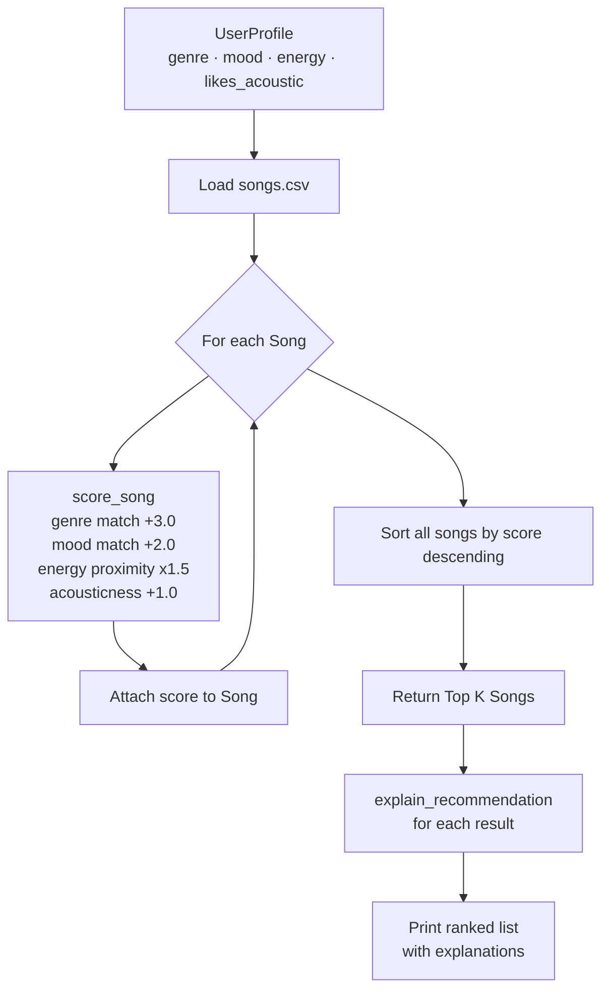

# 🎵 Music Recommender Simulation

## Project Summary

This project builds a small content-based music recommender system in Python. It represents songs as structured data objects, encodes user taste as a preference profile, and uses a weighted scoring function to rank songs and explain why each one was selected. The system is tested across multiple user profiles to explore how different taste preferences produce different recommendations.

---

## How The System Works

Real-world music recommenders like Spotify combine two main strategies: collaborative filtering, which identifies users with similar listening behavior and surfaces what they enjoyed, and content-based filtering, which matches a user's taste profile directly to song attributes like genre, tempo, and energy. Platforms layer these with engagement signals (skips, saves, replays) to continuously refine predictions.

This simulator uses a simplified content-based approach. Each song is described by a fixed set of musical features, and each user profile encodes a preference value for those same features. A scoring function computes how well each song matches a given profile by rewarding categorical matches (genre, mood) and penalizing distance from numerical targets (energy, tempo). Songs are then ranked by score to produce recommendations, and each result includes a short explanation tied to the actual scoring logic.

**Features used in `Song` objects:**
- `title`, `artist` — metadata
- `genre` — categorical (pop, rock, lofi, jazz, edm, hip-hop, folk, country, r&b, ambient, synthwave, indie pop)
- `mood` — categorical (happy, chill, intense, moody, relaxed, focused)
- `energy` — float 0.0–1.0, overall intensity
- `tempo_bpm` — beats per minute
- `valence` — float 0.0–1.0, musical positivity
- `danceability` — float 0.0–1.0
- `acousticness` — float 0.0–1.0

**Features used in `UserProfile` objects:**
- `favorite_genre` — preferred genre string
- `favorite_mood` — preferred mood string
- `target_energy` — desired energy level (0.0–1.0)
- `likes_acoustic` — boolean preference for acoustic vs. electronic sound

### Algorithm Recipe

For each song in the catalog, the recommender computes a score using these weighted rules:

| Rule | Points |
|------|--------|
| Genre matches user's `favorite_genre` | +3.0 |
| Mood matches user's `favorite_mood` | +2.0 |
| Energy proximity: `1 - abs(target_energy - song_energy)` | +1.5 × similarity |
| Acousticness alignment with `likes_acoustic` | +1.0 |

Genre receives the highest weight because it is the strongest single predictor of taste. Mood is second because it captures the emotional context a user is seeking. Energy proximity is continuous rather than binary, so a song that is close but not exact still earns partial credit. Acousticness acts as a tiebreaker for users who have a strong preference for organic vs. electronic sound.

Songs are ranked by total score (descending) and the top K results are returned with explanations.

### Data Flow



### Expected Bias

This system may over-prioritize genre at the expense of mood, since the genre weight (3.0) is large enough that two songs with the same genre will often outscore a better mood+energy match in a different genre. A user who enjoys jazz but is in an intense mood may receive relaxed jazz recommendations rather than intense songs in another genre that fit the moment better. A future fix would be to allow users to set their own weights per session.

---

## Getting Started

### Setup

1. Create a virtual environment (optional but recommended):

   ```bash
   python -m venv .venv
   source .venv/bin/activate      # Mac or Linux
   .venv\Scripts\activate         # Windows
   ```

2. Install dependencies:

   ```bash
   pip install -r requirements.txt
   ```

3. Run the app:

   ```bash
   python -m src.main
   ```

### Running Tests

```bash
pytest
```

You can add more tests in `tests/test_recommender.py`.

---

## Experiments You Tried

*(Fill in after running the system with multiple profiles.)*

---

## Limitations and Risks

- Catalog is small (20 songs), so niche preferences may find few or no close matches.
- The system does not understand lyrics, language, or cultural context.
- Genre weighting may cause it to recommend songs that match the label but not the actual sound (e.g., two very different "rock" songs).
- No user history or feedback loop — preferences are static and hand-coded.

---

## Reflection

*(Complete after finishing model_card.md.)*

[**Model Card**](model_card.md)