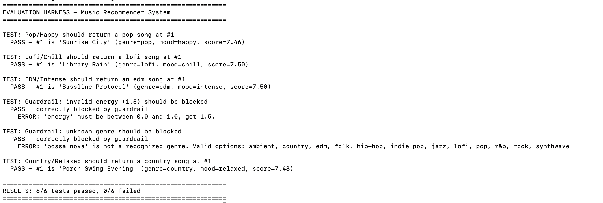
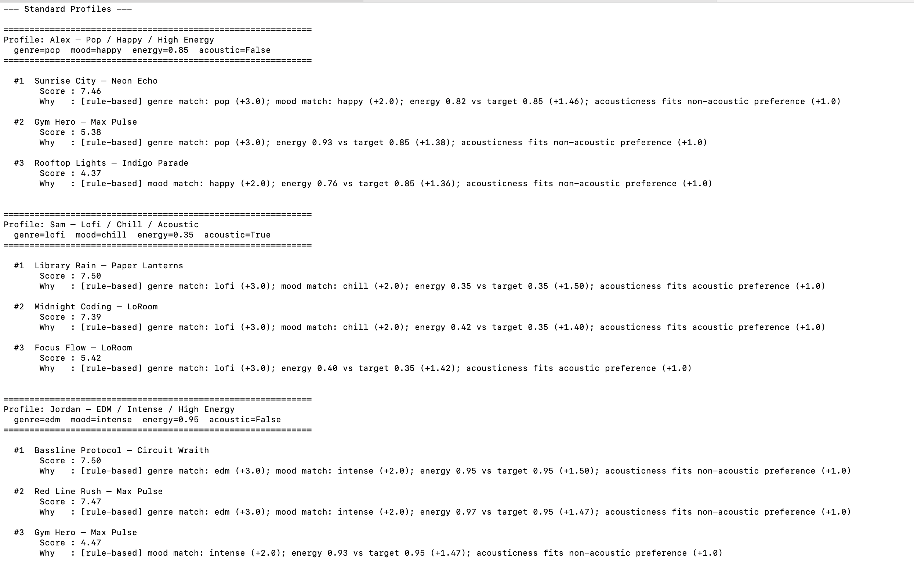
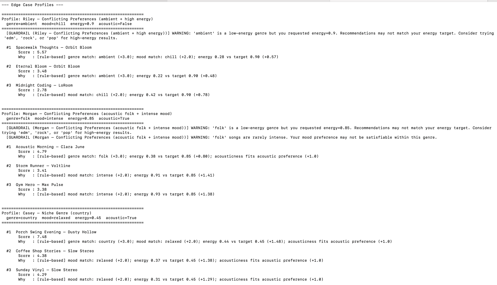
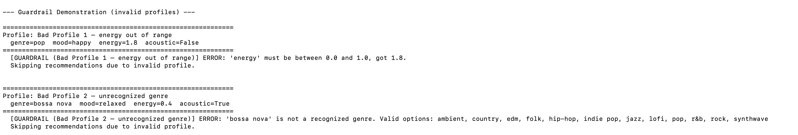

# 🎵 Applied AI Music Recommender System

> An evolution of the Module 3 Music Recommender, now with Retrieval-Augmented Generation (RAG), Gemini-powered explanations, input validation guardrails, and an automated evaluation harness.

---

## Base Project

This system extends the **Music Recommender Simulation** built in Module 3 (AI110). The original project used a weighted content-based filtering approach to rank songs from a 20-song CSV catalog against a user preference profile. It scored each song across four features (genre, mood, energy, acousticness) and returned ranked results with rule-based explanations. The system ran as a CLI script with three standard and three edge-case user profiles.

---

## What's New

| Feature | Description |
|---|---|
| **RAG retrieval** | Genre knowledge base (10 `.txt` docs) retrieved at query time to ground explanations |
| **Gemini AI explanations** | Google Gemini API generates natural-language explanations using retrieved context |
| **Input guardrails** | Validates profiles before scoring, blocks bad inputs, warns on conflicting preferences |
| **Evaluation harness** | `src/evaluator.py` runs 6 predefined tests and prints pass/fail summary |
| **Graceful fallback** | Falls back to rule-based explanations automatically if the API key is missing or the call fails |

---

## System Architecture

```
┌─────────────────────────────────────────────────────────────┐
│                        USER INPUT                           │
│              (genre, mood, energy, likes_acoustic)          │
└────────────────────────┬────────────────────────────────────┘
                         │
                         ▼
┌─────────────────────────────────────────────────────────────┐
│                   GUARDRAILS (guardrails.py)                 │
│  Validate energy range, genre, mood. Warn on conflicts.     │
└──────────┬──────────────────────────────────────────────────┘
           │ valid profile
           ▼
┌──────────────────────┐    ┌────────────────────────────────┐
│  RECOMMENDER         │    │  RAG RETRIEVAL (rag.py)        │
│  (recommender.py)    │    │  Load genre .txt doc and       │
│  score + rank songs  │    │  build context string          │
└──────────┬───────────┘    └──────────────┬─────────────────┘
           │ top-k songs                   │ genre context
           └───────────────┬───────────────┘
                           ▼
┌─────────────────────────────────────────────────────────────┐
│                   EXPLAINER (explainer.py)                  │
│  Call Gemini API with song + user prefs + RAG context.      │
│  Fallback to rule-based explanation if API unavailable.     │
└────────────────────────┬────────────────────────────────────┘
                         ▼
┌─────────────────────────────────────────────────────────────┐
│                        OUTPUT                               │
│         Ranked list: title, score, AI explanation           │
└─────────────────────────────────────────────────────────────┘
```

---

## Setup Instructions

### 1. Clone and enter the repo

```bash
git clone https://github.com/o0meerkat0o/applied-ai-system-project.git
cd applied-ai-system-project
```

### 2. Create a virtual environment

```bash
python -m venv .venv
source .venv/bin/activate      # Mac/Linux
.venv\Scripts\activate         # Windows
```

### 3. Install dependencies

```bash
pip install -r requirements.txt
```

### 4. Add your Gemini API key

Create a `.env` file in the project root:

```
GEMINI_API_KEY=your_key_here
```

Get your free key at [aistudio.google.com](https://aistudio.google.com). No credit card required. The system works without a key and falls back to rule-based explanations automatically.

### 5. Run the system

```bash
python -m src.main
```

### 6. Run the evaluation harness

```bash
python -m src.evaluator
```

### 7. Run the original tests

```bash
python -m pytest
```

---

## Sample Interactions

### Example 1: Standard profile with AI explanation

```
Profile: Alex  Pop / Happy / High Energy
  genre=pop  mood=happy  energy=0.85  acoustic=False

  #1  Sunrise City  Neon Echo
       Score : 7.46
       Why   : Sunrise City fits Alex perfectly. It is an upbeat pop track
               with high energy and a happy mood, exactly the kind of
               polished, danceable sound pop listeners gravitate toward.
```

### Example 2: Guardrail blocking a bad profile

```
Profile: Bad Profile 1  energy out of range
  genre=pop  mood=happy  energy=1.8  acoustic=False

  [GUARDRAIL] ERROR: energy must be between 0.0 and 1.0, got 1.8.
  Skipping recommendations due to invalid profile.
```

### Example 3: Conflict warning (still runs, but warned)

```
Profile: Riley  Conflicting Preferences (ambient + high energy)
  genre=ambient  mood=chill  energy=0.9  acoustic=False

  [GUARDRAIL] WARNING: ambient is a low-energy genre but you requested
  energy=0.9. Recommendations may not match your energy target.

  #1  Spacewalk Thoughts  Orbit Bloom
       Score : 5.57
       Why   : Spacewalk Thoughts is the closest ambient match available,
               though ambient music is fundamentally quiet and atmospheric.
               Switching to edm or rock would better serve a high-energy need.
```

---

## Design Decisions

**Why RAG over static templates?** Rule-based explanations just repeat the scoring math. RAG lets the system pull real genre knowledge and pass it to Gemini so explanations reference actual musical characteristics like tempo ranges, cultural context, and listener use cases.

**Why a fallback to rule-based?** The system should work without an API key. Students, reviewers, and CI pipelines should not need credentials just to run the code.

**Why does invalid genre block hard but energy conflict only warn?** An unrecognized genre breaks the scoring function entirely. An energy conflict is softer and results are still meaningful, just potentially surprising.

**Why Gemini?** The Gemini API has a free tier with no credit card required, which makes this project accessible and reproducible without any cost barrier.

---

## Testing Summary

```
6/6 tests passed
- 3 scoring correctness tests: top result matched expected genre and mood ✓
- 2 guardrail block tests: invalid profiles correctly rejected ✓
- 1 niche-genre test: country profile returned correct #1 result ✓
```





---

## Reflection

Building this extension showed how much the explanation layer matters for user trust. The original rule-based explanations feel mechanical. Passing the same data through Gemini with retrieved genre context produces explanations that feel like advice from someone who actually knows music.

The most useful AI suggestion during development was the structure for the RAG context string. Including both the genre document and a summary of user preferences in the same prompt gave Gemini enough grounding to write specific, accurate explanations. The flawed suggestion was using cosine similarity on TF-IDF vectors for retrieval across 10 documents, which added unnecessary complexity when a simple dictionary lookup is faster and more predictable.

---

## Model Card

[**Model Card**](model_card.md)
